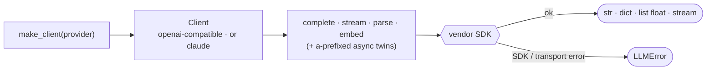

# thinchat

[](https://github.com/seokhoonj/thinchat/actions/workflows/check.yml)
[](https://pypi.org/project/thinchat/)
[](https://pypi.org/project/thinchat/)
[](https://github.com/seokhoonj/thinchat/blob/main/LICENSE)

[English](README.md) | **한국어**

네 개의 LLM provider — **claude, openai, gemini, ollama** — 를 위한 작고 통일된 클라이언트.

provider 이름만 대면 호출됩니다. 모든 클라이언트가 completion(전체·스트리밍·JSON 구조화)을
제공하고, provider가 지원하면 embeddings도 제공하며, 각각 async 짝이 있습니다. gateway도,
router도, 비용 추적도 없이 — provider 자신의 SDK 위에서 호출만 합니다.

## 동작 방식



`make_client`는 provider를 하나의 factory map에서 찾습니다: openai/gemini/ollama는 openai
SDK 위의 단일 클래스를 공유하고(데이터만 다름), claude는 anthropic 위에 자기 것을 둡니다.
호출은 요청을 조립해 SDK를 치고, 응답을 추출하거나 실패를 하나의 `LLMError`로 매핑합니다.

## 설치

```sh
pip install thinchat
```

두 provider SDK(openai와 anthropic)가 함께 설치되어 모든 provider가 바로 동작합니다. 각 SDK는
해당 클라이언트를 처음 생성할 때 lazy하게 import됩니다.

## 사용

```python
from thinchat import make_client

llm = make_client("claude")                     # 키는 CLAUDE_API_KEY에서
print(llm.complete("Say hi in one word."))
print(llm.complete("Name a color.", system="Answer in one word."))   # system=은 모든 verb를 유도

# 구조화 출력: 응답을 JSON 객체로 파싱. schema는 생성을 유도할 뿐 로컬에서 검증하지 않으므로,
# 반환된 dict의 필드는 직접 확인하세요.
verdict = llm.parse(
    "Is this an ad? 'Buy now, 50% off — order today'",
    schema={"type": "object",
            "properties": {"is_ad": {"type": "boolean"}, "reason": {"type": "string"}},
            "required": ["is_ad"]},
)
print(verdict["is_ad"])

# 스트리밍.
for chunk in make_client("claude").stream("Count to five."):
    print(chunk, end="")

# 임베딩 (openai / gemini / ollama; Claude는 없음).
vectors = make_client("openai").embed(["hello", "world"])
```

모든 verb에는 async 짝이 있습니다 — `acomplete`, `astream`, `aparse`, `aembed`:

```python
llm = make_client("claude")
text = await llm.acomplete("Summarize in one line: ...")
```

## Provider

| provider | 키 환경변수        | embeddings |
|----------|-------------------|------------|
| `claude` | `CLAUDE_API_KEY`  | 아니오     |
| `openai` | `OPENAI_API_KEY`  | 예         |
| `gemini` | `GEMINI_API_KEY`  | 예         |
| `ollama` | 없음 (로컬)        | 예         |

openai, gemini, ollama는 동일한 OpenAI 호환 API를 쓰므로 하나의 SDK가 셋을 다 처리하고, base
URL·키·기본 모델만 다릅니다. Ollama는 로컬에서 실행되며(`OLLAMA_HOST`, 기본
`http://localhost:11434`) 키가 필요 없습니다.

각 provider는 공통으로 노출하는 설정을 같은 이름으로 받으며, **값을 줄 때만** 전송합니다:
`max_tokens`(응답 길이), `temperature`/`top_p`(샘플링), `timeout`(초)/`max_retries`(HTTP
클라이언트) — 예: `make_client("claude", temperature=0.2, timeout=30)`. 값을 안 주면 provider
자체 기본이 적용되고, 예외는 `max_tokens`뿐입니다 — Anthropic이 필수로 요구해 claude는 기본
4096을 쓰고, OpenAI 호환 provider들은 생략해 모델이 정하게 둡니다.

키는 환경에서 읽습니다. 셸 프로파일(`~/.bashrc`, `~/.zshrc`)에 한 번 넣어두면 모든 세션이
인식합니다 — thinchat은 라이브러리라 자체 파일 위치를 강제하지 않습니다:

```sh
export CLAUDE_API_KEY="sk-ant-..."
export OPENAI_API_KEY="sk-..."
export GEMINI_API_KEY="..."          # ollama는 로컬이라 키 불필요
```

또는 환경변수를 덮어쓰며 키를 직접 넘길 수도 있습니다:

```python
llm = make_client("claude", api_key="sk-ant-...", model="claude-haiku-4-5-20251001")
```

## 지원 기능(Capabilities)

provider가 지원하지 않는 기능을 호출하면 `UnsupportedError`가 발생합니다. 기능은 `completion`,
`streaming`, `structured_output`, `embeddings`이며, `supports`로 먼저 확인하세요:

```python
make_client("claude").supports("embeddings")   # False
```

## 에러

thinchat이 의도적으로 던지는 모든 에러는 `ThinchatError`에서 파생되므로, 하나의 `except`로 이
패키지의 실패를 처리할 수 있습니다:

- `UnknownProviderError` — 이름이 네 provider 중 하나가 아님.
- `ProviderUnavailableError` — provider의 SDK가 설치되지 않았거나, API 키가 없음.
- `UnsupportedError` — provider가 그 기능을 지원하지 않음(예: Claude의 embeddings).
- `LLMError` — API 호출이 실패했거나, 응답이 비었거나 형식이 잘못됨.

## 라이프사이클

클라이언트는 HTTP 연결 풀을 보유합니다. 일회성 스크립트라면 신경 쓰지 않아도 되지만, 요청마다
클라이언트를 만드는 서버라면 연결이 새지 않도록 닫아야 합니다 — context manager로 쓰거나
`close()` / `aclose()`를 호출하세요:

```python
with make_client("claude") as llm:
    llm.complete("...")                 # 동기: 종료 시 풀을 닫음

async with make_client("claude") as llm:
    await llm.acomplete("...")          # 비동기: async 풀도 닫음
```

`close()`는 동기 풀을 해제합니다. async verb를 사용했다면 `aclose()`나 `async with`로 async
풀까지 닫으세요.

## 라이선스

MIT
