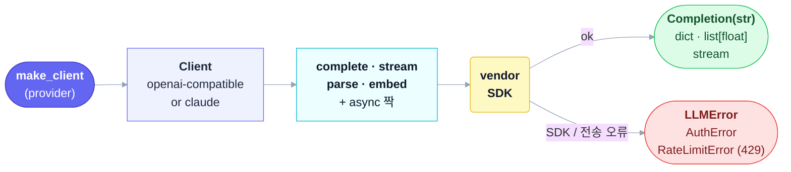

# thinchat

[](https://github.com/seokhoonj/thinchat/actions/workflows/check.yml)
[](https://pypi.org/project/thinchat/)
[](https://pypi.org/project/thinchat/)
[](https://github.com/seokhoonj/thinchat/blob/main/LICENSE)

[English](README.md) | **한국어**

네 개의 LLM provider — **claude, openai, gemini, ollama** — 를 하나의 인터페이스로, 그리고
**API 키를 흘리지 않는 것**을 일의 일부로 다룹니다.

provider 이름만 대면 호출됩니다: completion(전체·스트리밍·JSON 구조화)과, provider가 지원하면
embeddings — 각각 async 짝이 있고, openai·anthropic 두 SDK 위에서 돕니다. gateway도 router도
비용 추적도 없이, 호출만 — 그리고 원래라면 손수 짜야 했을 것들까지:

- **유출 안전한 키.** 키는 credbox `Secret`(로그·트레이스백에서 마스킹)으로 다뤄지고, SDK 호출
  시점에만 드러납니다. 호출이 실패하면 thinchat이 SDK 에러의 체인을 끊고(sever) 메시지를
  스크럽해 키가 트레이스백에 실려 나가지 않으며 — 각 provider의 공식 엔드포인트를 고정(pin)해
  환경변수가 해석된 키를 다른 호스트로 돌려보내지 못하게 합니다.
- **하나의 공유 키 저장소.** `thinchat set claude`로 키를 한 번 저장하면 0600 저장소에 기록되어
  모든 세션 — 그리고 형제 도구들 — 이 거기서 찾습니다; 아니면 그냥 환경변수
  `<PROVIDER>_API_KEY`를 쓰세요(라이브러리 코어는 요청하지 않는 한 파일을 읽지 않습니다).
- **자잘한 것들 처리.** 구조화 출력은 관대한 JSON(펜스·산문)을 dict로 파싱하고, 임베딩은
  입력당 벡터 하나를 정합 검사해 돌려주며, `RateLimitError`는 `retry_after`를 담고,
  `supports()`는 호출 전에 provider 기능을 알려줍니다.

## 1. 설치

```sh
pip install thinchat
```

Python 3.11+ 필요. 두 provider SDK(openai와 anthropic)가 함께 설치되어 모든 provider가 바로
동작합니다. 각 SDK는 해당 클라이언트를 처음 생성할 때 lazy하게 import됩니다.

## 2. 사용

```python
from thinchat import make_client

llm = make_client("claude")                     # 키는 CLAUDE_API_KEY에서 (§3 참고)
print(llm.complete("대한민국 수도가 어디야?"))
print(llm.complete("파이썬이 뭐야?", system="한 문장으로만 답해줘."))   # system=은 생성 verb(complete·stream·parse)에 적용

# 구조화 출력: schema는 정해진 것이 아니라 본인이 자유롭게 정의하면 됩니다 — 모델이 그 모양의
# JSON 객체로 채워 줍니다. 다만 결과값 검증이 100% 되지는 않으므로 반환된 dict의 필드가
# 적절히 되어 있는지 직접 확인하고 쓰셔야 합니다.
review = llm.parse(
    "이 리뷰 감정을 분석해줘: '배송도 빠르고 품질도 만족스러워요'",
    schema={"type": "object",
            "properties": {"sentiment": {"type": "string"}, "score": {"type": "number"}},
            "required": ["sentiment"]},
)
print(review["sentiment"])

# 스트리밍.
for chunk in make_client("claude").stream("가을에 대한 짧은 시 하나 써줘."):
    print(chunk, end="")

# 임베딩 (openai / gemini / ollama 가능; claude 불가).
vectors = make_client("openai").embed(["강아지", "고양이"])
```

`complete`는 `Completion`을 돌려줍니다 — 그냥 텍스트로 쓸 수 있는 `str`이면서, 답이 토큰
상한에 걸려 잘렸는지까지 알 수 있게 메타데이터도 함께 담습니다:

```python
reply = make_client("claude", max_tokens=50).complete("강에 대한 긴 글을 써줘.")
print(reply)                       # str: 출력·슬라이싱·비교 모두 문자열처럼
if reply.truncated:                # 답이 토큰 상한에 걸려 잘렸으면 True
    print(f"잘림 (finish_reason={reply.finish_reason})")   # .usage / .model 도 사용 가능
```

모든 verb에는 async 짝이 있습니다 — `acomplete`, `astream`, `aparse`, `aembed`:

```python
import asyncio

async def main():
    llm = make_client("claude")
    text = await llm.acomplete("이 문장을 한 줄로 요약해줘: ...")

asyncio.run(main())
```

## 3. API 키

thinchat은 provider의 키를 세 곳에서, 이 순서로 해석합니다 — **`api_key=` → 환경변수 → 저장
파일** — 편한 것을 쓰세요.

**1. 직접 넘기기** — 자체 시크릿을 관리하는 호출자; 파일은 전혀 읽지 않음:

```python
llm = make_client("claude", api_key="sk-ant-...")
```

**2. 환경변수** `<PROVIDER>_API_KEY` — 셸 세션·컨테이너·CI에 적합:

```sh
export CLAUDE_API_KEY="sk-ant-..."     # 또는 OPENAI_API_KEY / GEMINI_API_KEY; ollama는 불필요
```

**3. 한 번 저장** — `thinchat` 명령으로 0600 저장소(`~/.config/thinchat/credentials.json`)에
기록하면 export 없이도 모든 세션이 찾습니다. 값 전체는 절대 출력되지 않습니다(`set`은 에코 없이
입력받고, `get`은 양 끝만 남기고 마스킹):

```sh
thinchat set claude      # 키 입력(에코 없음) 후 저장
thinchat list            # 어떤 provider에 키가 저장됐는지
thinchat get claude      # 해석된 키를 마스킹해 표시
thinchat unset claude    # 저장된 키 삭제
```

환경변수는 항상 저장 파일을 이기므로, 컨테이너나 CI에서는 `<PROVIDER>_API_KEY`만 설정하면 파일
없이 저장소를 덮어씁니다. 같은 동작을 Python에서도 쓸 수 있어, 상위 앱이 사용자를 위해 저장소를
채우거나 읽어줄 수 있습니다:

```python
from thinchat import set_api_key, get_api_key, stored_providers, unset_api_key

set_api_key("claude", value="sk-ant-...")
key = get_api_key("claude")   # credbox Secret | None (repr/str/로그에서 마스킹; 평문은 .reveal())
stored_providers()            # ["claude", ...] — 저장소에 있는 provider들
unset_api_key("claude")
```

> **Claude는 `CLAUDE_API_KEY`를 쓰고, anthropic SDK 자체의 `ANTHROPIC_API_KEY`가 아닙니다.**
> thinchat은 해석된 키를 항상 SDK에 명시적으로 넘기므로, 환경에 남은 `ANTHROPIC_API_KEY`는 절대
> 사용되지 않습니다.

## 4. Provider

| provider | 키 환경변수        | embeddings |
|----------|-------------------|------------|
| `claude` | `CLAUDE_API_KEY`  | 아니오     |
| `openai` | `OPENAI_API_KEY`  | 예         |
| `gemini` | `GEMINI_API_KEY`  | 예         |
| `ollama` | 없음 (로컬)        | 예         |

openai, gemini, ollama는 동일한 OpenAI 호환 API를 쓰므로 하나의 SDK가 셋을 다 처리하고, base
URL·키·기본 모델만 다릅니다. Ollama는 로컬에서 실행되며(`OLLAMA_HOST`, 기본
`http://localhost:11434`) 키가 필요 없습니다.

각 provider는 공통으로 노출하는 설정을 같은 이름으로, **값을 줄 때만** 전송합니다:
`max_tokens`(응답 길이), `temperature`/`top_p`(샘플링), `timeout`(초)/`max_retries`(HTTP
클라이언트) — 예: `make_client("claude", temperature=0.2, timeout=30)`. 값을 안 주면 provider
자체 기본이 적용되고, 예외는 `max_tokens`뿐입니다 — Anthropic이 필수로 요구해 claude는 기본
4096, OpenAI 호환 provider들은 생략해 모델이 정하게 둡니다. 모든 verb는 호출별 `model=`과
`extra={...}` passthrough도 받습니다(§9).

게이트웨이·프록시·Azure류 엔드포인트로 보내려면 `make_client`에 `base_url=`을 넘깁니다
(`make_client("openai", base_url="https://gateway.internal/v1")`). 넘기지 않으면 thinchat은 각
provider의 공식 엔드포인트를 고정(pin)합니다 — 그래서 vendor SDK가 자체 `OPENAI_BASE_URL` /
`ANTHROPIC_BASE_URL`를 읽지 않아, 환경변수는 쓸 수 있지만 0600 저장소는 못 읽는 쪽이 해석된
키를 다른 호스트로 돌려보낼 수 있던 경로를 막습니다. ollama는 여전히 `OLLAMA_HOST`에서 로컬
엔드포인트를 해석합니다.

## 5. 지원 기능(Capabilities)

provider가 지원하지 않는 기능을 호출하면 `UnsupportedError`가 발생합니다. 기능은 `completion`,
`streaming`, `structured_output`, `embeddings`이며, `supports`로 먼저 확인하세요:

```python
make_client("claude").supports("embeddings")   # False
```

## 6. 에러

thinchat이 의도적으로 던지는 모든 에러는 `ThinchatError`에서 파생되므로, 하나의 `except`로 이
패키지의 실패를 처리할 수 있습니다:

- `UnknownProviderError` — 이름이 네 provider 중 하나가 아님.
- `ProviderUnavailableError` — provider의 SDK가 설치되지 않았거나, API 키가 없음.
- `UnsupportedError` — provider에서 그 작업이 불가능함: 없는 기능(예: Claude의 embeddings),
  또는 키가 필요 없는 ollama에 키를 저장하려는 경우.
- `BlankKeyError` — `set_api_key`(또는 `thinchat set`)에 빈 값/공백 키가 들어옴. `ValueError`
  이기도 해서 `except ValueError`로도 잡힙니다.
- `CredentialStoreError` — 저장소 파일(`~/.config/thinchat/credentials.json`)이 존재하지만
  읽을 수 없거나 형식이 잘못됨, 또는 쓰기에 실패함.
- `LLMError` — API 호출이 실패했거나, 응답이 비었거나 형식이 잘못됨. `status_code`에는 HTTP
  상태 코드가 담겨(있을 때) 일시적 5xx와 영구적 4xx를 구분해 분기할 수 있고, API 키는 메시지와
  그 cause 체인에서 마스킹됩니다.
- `AuthError` — 자격 증명이 거부됨(HTTP 401/403): 키가 없거나·잘못됐거나·폐기됐거나 권한이
  없음. `LLMError`의 subclass라 `except LLMError`로도 잡힙니다.
- `RateLimitError` — SDK 자체 재시도 후에도 발생한 429 rate limit. `LLMError`의 subclass라
  기존 handler도 그대로 잡으며, `retry_after`에는 다시 시도하기까지 몇 초 기다리면 되는지(서버가
  준 Retry-After 값)가, 서버가 안 주면 `None`이 담깁니다.

실제 backoff는 vendor SDK가 `max_retries`를 통해 Retry-After를 준수하며 수행하고, thinchat은
별도의 retry loop를 추가하지 않습니다.

```python
from thinchat import make_client, RateLimitError

with make_client("gemini") as llm:
    try:
        print(llm.complete("안녕!"))
    except RateLimitError as e:
        print(f"rate limited; wait {e.retry_after} seconds")
```

## 7. 라이프사이클

클라이언트는 HTTP 연결 풀을 보유합니다. 일회성 스크립트라면 신경 쓰지 않아도 되지만, 요청마다
클라이언트를 만드는 서버라면 연결이 새지 않도록 닫아야 합니다 — context manager로 쓰거나
`close()` / `aclose()`를 호출하세요:

```python
with make_client("claude") as llm:
    llm.complete("...")                 # 동기: 종료 시 풀을 닫음

async with make_client("claude") as llm:
    await llm.acomplete("...")          # 비동기: async 풀도 닫음
```

`close()`는 동기 풀을 해제합니다. async verb를 사용했다면 `aclose()`나 `async with`로 async
풀까지 닫으세요.

**async** 스트림을 중간에 그만 소비하면(`async for`에서 `break`, 또는 클라이언트 연결 끊김)
이벤트 루프가 제너레이터를 정리할 때까지 기다리지 않고 곧바로 연결이 풀로 돌아가도록 명시적으로
닫으세요: `async with aclosing(llm.astream(...)) as s:`(`contextlib`) 또는 `await s.aclose()`.
동기 `stream`은 `break` 시 스스로 해제되므로 async 스트림에만 필요합니다.

## 8. 동작 방식



`make_client`는 provider를 하나의 factory map에서 찾습니다: openai/gemini/ollama는 openai
SDK 위의 단일 클래스를 공유하고(데이터만 다름), claude는 anthropic 위에 자기 것을 둡니다.
호출은 요청을 조립해 SDK를 치고, 응답을 추출하거나 실패를 `LLMError`로 매핑합니다(401/403은
`AuthError`, SDK 재시도 후의 429는 `RateLimitError`).

## 9. 범위와 안정성

thinchat은 의도적으로 **단일 턴(single-turn) completion** 클라이언트입니다: 각 호출은 하나의
`prompt`와 선택적 `system`을 받아 답을 텍스트(`Completion` — `.finish_reason`/`.truncated`/
`.usage`/`.model`도 담은 `str`)로, 또는 JSON 객체·벡터로 돌려줍니다. 멀티턴 대화
기록, tool/function calling, 토큰·사용량·비용 리포팅, 비전 등 멀티모달 입력은 **다루지
않습니다** — 그런 경우 provider SDK를 직접 쓰세요. `parse()`는 답을 schema 방향으로 유도할 뿐
강제하지는 않으며(§2), `embed()`에 리스트가 아니라 단일 문자열을 주면 `TypeError`(ThinchatError
아님)가 납니다.

모든 verb는 호출별 `model=`(그 호출에 한해 기본 모델을 덮어씀)과 `extra={...}`(provider별
요청 필드를 요청에 병합 — OpenAI `seed`, Anthropic `thinking` 등)를 받습니다. 이런 필드는
provider마다 다르고 **provider 간 자동 변환되지 않으며**, 요청에만 반영될 뿐 응답 형태는
그대로 텍스트입니다. provider별 기본 **모델**과 `max_tokens`는 현재 provider 기본값을 따라가며
고정(pin)되지 않습니다 — 재현이 필요하면 `model=` / `max_tokens=`를 넘기세요. `Secret`은
credbox에서 re-export되며, 마스킹과 `.reveal()`은 credbox가 관장합니다.

1.0 이전(0.x): provider 로스터와 그 순서, 에러 계층, `make_client`·키 관리 시그니처, `Secret`
반환 타입은 안정적입니다(테스트로 고정). 기본 모델과 bare `LLMError`의 메시지 텍스트는 릴리스
간 바뀔 수 있습니다.

## 10. 개발

클론 후 dev extras를 설치하고, CI가 돌리는 것을 그대로 실행하세요:

```sh
uv venv && uv pip install -e ".[dev]"
make check          # test + lint + types  (또는: pytest -q && ruff check src tests && mypy)
```

CI는 추가로 패키지를 빌드해 base 설치가 provider SDK를 eager import하지 않고 `py.typed`를
포함하는지 검증합니다.

## 11. 라이선스

[MIT](LICENSE)
