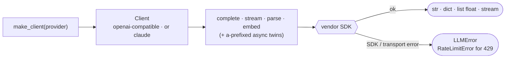

# thinchat

[](https://github.com/seokhoonj/thinchat/actions/workflows/check.yml)
[](https://pypi.org/project/thinchat/)
[](https://pypi.org/project/thinchat/)
[](https://github.com/seokhoonj/thinchat/blob/main/LICENSE)

**English** | [한국어](README.ko.md)

A thin, unified client for four LLM providers — **claude, openai, gemini, ollama**.

Name a provider, then call it. Every client offers completion — whole, streamed, or
JSON-structured — and, where the provider has one, embeddings, each with an async twin. No
gateway, no router, no cost tracking: just the calls, over the openai and anthropic SDKs.

## 1. Install

```sh
pip install thinchat
```

Requires Python 3.11+. Both provider SDKs (openai and anthropic) come with it, so every
provider works out of the box; each is imported lazily the first time you construct its
client.

## 2. Use

```python
from thinchat import make_client

llm = make_client("claude")                     # key from CLAUDE_API_KEY
print(llm.complete("Say hi in one word."))
print(llm.complete("Name a color.", system="Answer in one word."))   # system= steers the generation verbs

# Structured output: you invent the schema; the model fills a JSON object into that shape.
# It steers generation but is not validated locally, so check the returned fields yourself.
review = llm.parse(
    "Analyze the sentiment: 'Fast shipping and great quality.'",
    schema={"type": "object",
            "properties": {"sentiment": {"type": "string"}, "score": {"type": "number"}},
            "required": ["sentiment"]},
)
print(review["sentiment"])

# Streaming.
for chunk in make_client("claude").stream("Count to five."):
    print(chunk, end="")

# Embeddings (openai / gemini / ollama supported; not claude).
vectors = make_client("openai").embed(["hello", "world"])
```

Every verb has an async twin — `acomplete`, `astream`, `aparse`, `aembed`:

```python
llm = make_client("claude")
text = await llm.acomplete("Summarize in one line: ...")
```

## 3. Providers

| provider | key env           | embeddings |
|----------|-------------------|------------|
| `claude` | `CLAUDE_API_KEY`  | no         |
| `openai` | `OPENAI_API_KEY`  | yes        |
| `gemini` | `GEMINI_API_KEY`  | yes        |
| `ollama` | none (local)      | yes        |

openai, gemini, and ollama speak the same OpenAI-compatible API, so one SDK serves all
three; only the base URL, key, and default models differ. Ollama runs locally
(`OLLAMA_HOST`, default `http://localhost:11434`) and needs no key.

Each provider takes the settings it exposes under the same name, sent only when you set them:
`max_tokens` (reply length), `temperature` / `top_p` (sampling), and `timeout` in seconds /
`max_retries` (the HTTP client) — e.g. `make_client("claude", temperature=0.2, timeout=30)`.
An unset value leaves the provider's own default in place, except `max_tokens`, which
Anthropic requires and so defaults to 4096 for claude (the OpenAI-compatible providers omit
it, letting the model decide).

thinchat resolves a provider's key in three tiers, in order: an explicit `api_key=` passed to
`make_client`, then the `<PROVIDER>_API_KEY` environment variable, then thinchat's own store
(`~/.config/thinchat/credentials.json`, mode 0600). The library core is unchanged — pass
`api_key=` and no file is ever read:

```python
llm = make_client("claude", api_key="sk-ant-...", model="claude-haiku-4-5-20251001")
```

For a shell session, set the environment variable once in your profile (`~/.bashrc`,
`~/.zshrc`) so every session picks it up:

```sh
export CLAUDE_API_KEY="sk-ant-..."   # ollama runs locally and needs no key
```

Or save a key once with the `thinchat` command, which writes the 0600 store so every session
finds it without an export — the value is never printed (`set` reads it without echo, `get`
masks it):

```sh
thinchat set claude      # prompt for the key, store it
thinchat list            # which providers have a stored key
thinchat get claude      # show the resolved key, masked
thinchat unset claude    # remove it
```

The same operations are available programmatically — `thinchat.set_api_key("claude",
value=...)`, `thinchat.get_api_key("claude")`, `thinchat.stored_providers()`,
`thinchat.unset_api_key(...)` — so a parent application can populate or read the store for its
user. An environment variable always wins over the
stored file, so a container or CI run overrides the store by setting `<PROVIDER>_API_KEY`,
with no file needed.

## 4. Capabilities

A client whose provider lacks a capability raises `UnsupportedError`. The capabilities are
`completion`, `streaming`, `structured_output`, and `embeddings`; check first with `supports`:

```python
make_client("claude").supports("embeddings")   # False
```

## 5. Errors

Everything thinchat raises on purpose derives from `ThinchatError`, so one `except` handles
the package's failures:

- `UnknownProviderError` — the name isn't one of the four providers.
- `ProviderUnavailableError` — the provider's SDK isn't installed, or no API key is set.
- `UnsupportedError` — the operation isn't available for the provider: a missing capability
  (e.g. embeddings on Claude), or storing a key for keyless ollama.
- `CredentialStoreError` — the stored-key file (`~/.config/thinchat/credentials.json`) is
  present but unreadable or malformed, or could not be written.
- `LLMError` — the API call failed, or the reply was empty or malformed.
- `RateLimitError` — a 429 rate limit after the SDK's own retries. It is a subclass of
  `LLMError`, so existing handlers still catch it, and its `retry_after` is how many
  seconds to wait before trying again (from the server's Retry-After), or `None` when the
  server did not give one.

The vendor SDK performs the actual backoff through `max_retries`, honoring Retry-After;
thinchat adds no retry loop.

```python
from thinchat import make_client, RateLimitError

with make_client("gemini") as llm:
    try:
        print(llm.complete("Say hi."))
    except RateLimitError as e:
        print(f"rate limited; wait {e.retry_after} seconds")
```

## 6. Lifecycle

A client holds an HTTP connection pool. For a one-off script you can ignore it; for a
server that builds a client per request, close it so connections do not leak — use it as a
context manager, or call `close()` / `aclose()`:

```python
with make_client("claude") as llm:
    llm.complete("...")                 # sync: closes the pool on exit

async with make_client("claude") as llm:
    await llm.acomplete("...")          # async: closes the async pool too
```

`close()` frees the sync pool; if you drove async verbs, release with `aclose()` or
`async with` so the async pool is closed as well.

## 7. How it works



`make_client` looks the provider up in one factory map: openai/gemini/ollama share a single
class over the openai SDK (they differ only in data); claude has its own over anthropic.
A call builds the request, hits the SDK, and either extracts the reply or maps the failure
to `LLMError`, using `RateLimitError` for a 429 after the SDK's retries.

## 8. License

MIT
