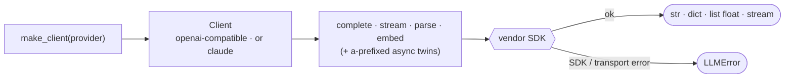

# thinchat

[](https://github.com/seokhoonj/thinchat/actions/workflows/check.yml)
[](https://pypi.org/project/thinchat/)
[](https://pypi.org/project/thinchat/)
[](https://github.com/seokhoonj/thinchat/blob/main/LICENSE)

**English** | [한국어](README.ko.md)

A thin, unified client for four LLM providers — **claude, openai, gemini, ollama**.

Name a provider, then call it. Every client offers completion — whole, streamed, or
JSON-structured — and, where the provider has one, embeddings, each with an async twin. No
gateway, no router, no cost tracking: just the calls, over the providers' own SDKs.

## 1. Install

```sh
pip install thinchat
```

Requires Python 3.11+. Both provider SDKs (openai and anthropic) come with it, so every
provider works out of the box; each is imported lazily the first time you construct its
client.

## 2. Use

```python
from thinchat import make_client

llm = make_client("claude")                     # key from CLAUDE_API_KEY
print(llm.complete("Say hi in one word."))
print(llm.complete("Name a color.", system="Answer in one word."))   # system= steers any verb

# Structured output: reply parsed into a JSON object. The schema steers generation
# but is not validated locally, so check the returned dict's fields yourself.
verdict = llm.parse(
    "Is this an ad? 'Buy now, 50% off — order today'",
    schema={"type": "object",
            "properties": {"is_ad": {"type": "boolean"}, "reason": {"type": "string"}},
            "required": ["is_ad"]},
)
print(verdict["is_ad"])

# Streaming.
for chunk in make_client("claude").stream("Count to five."):
    print(chunk, end="")

# Embeddings (openai / gemini / ollama; Claude has none).
vectors = make_client("openai").embed(["hello", "world"])
```

Every verb has an async twin — `acomplete`, `astream`, `aparse`, `aembed`:

```python
llm = make_client("claude")
text = await llm.acomplete("Summarize in one line: ...")
```

## 3. Providers

| provider | key env           | embeddings |
|----------|-------------------|------------|
| `claude` | `CLAUDE_API_KEY`  | no         |
| `openai` | `OPENAI_API_KEY`  | yes        |
| `gemini` | `GEMINI_API_KEY`  | yes        |
| `ollama` | none (local)      | yes        |

openai, gemini, and ollama speak the same OpenAI-compatible API, so one SDK serves all
three; only the base URL, key, and default models differ. Ollama runs locally
(`OLLAMA_HOST`, default `http://localhost:11434`) and needs no key.

Each provider takes the settings it exposes under the same name, sent only when you set them:
`max_tokens` (reply length), `temperature` / `top_p` (sampling), and `timeout` in seconds /
`max_retries` (the HTTP client) — e.g. `make_client("claude", temperature=0.2, timeout=30)`.
An unset value leaves the provider's own default in place, except `max_tokens`, which
Anthropic requires and so defaults to 4096 for claude (the OpenAI-compatible providers omit
it, letting the model decide).

Keys are read from the environment. Set them once in your shell profile (`~/.bashrc`,
`~/.zshrc`) so every session picks them up — thinchat is a library and never imposes a file
location of its own:

```sh
export CLAUDE_API_KEY="sk-ant-..."
export OPENAI_API_KEY="sk-..."
export GEMINI_API_KEY="..."          # ollama runs locally and needs no key
```

Or pass a key explicitly, which overrides the environment:

```python
llm = make_client("claude", api_key="sk-ant-...", model="claude-haiku-4-5-20251001")
```

## 4. Capabilities

A client whose provider lacks a capability raises `UnsupportedError`. The capabilities are
`completion`, `streaming`, `structured_output`, and `embeddings`; check first with `supports`:

```python
make_client("claude").supports("embeddings")   # False
```

## 5. Errors

Everything thinchat raises on purpose derives from `ThinchatError`, so one `except` handles
the package's failures:

- `UnknownProviderError` — the name isn't one of the four providers.
- `ProviderUnavailableError` — the provider's SDK isn't installed, or no API key is set.
- `UnsupportedError` — the provider lacks the capability (e.g. embeddings on Claude).
- `LLMError` — the API call failed, or the reply was empty or malformed.

## 6. Lifecycle

A client holds an HTTP connection pool. For a one-off script you can ignore it; for a
server that builds a client per request, close it so connections do not leak — use it as a
context manager, or call `close()` / `aclose()`:

```python
with make_client("claude") as llm:
    llm.complete("...")                 # sync: closes the pool on exit

async with make_client("claude") as llm:
    await llm.acomplete("...")          # async: closes the async pool too
```

`close()` frees the sync pool; if you drove async verbs, release with `aclose()` or
`async with` so the async pool is closed as well.

## 7. How it works



`make_client` looks the provider up in one factory map: openai/gemini/ollama share a single
class over the openai SDK (they differ only in data); claude has its own over anthropic.
A call builds the request, hits the SDK, and either extracts the reply or maps the failure
to one `LLMError`.

## 8. License

MIT
