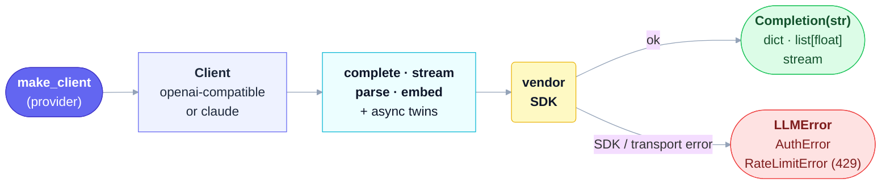

# thinchat

[](https://github.com/seokhoonj/thinchat/actions/workflows/check.yml)
[](https://pypi.org/project/thinchat/)
[](https://pypi.org/project/thinchat/)
[](https://github.com/seokhoonj/thinchat/blob/main/LICENSE)

**English** | [한국어](README.ko.md)

One interface for four LLM providers — **claude, openai, gemini, ollama** — that treats **not
leaking your API key** as part of the job.

Name a provider, then call it: completion (whole, streamed, or JSON-structured) and, where the
provider has one, embeddings — each with an async twin, over the openai and anthropic SDKs. No
gateway, no router, no cost tracking — just the calls, plus the parts you'd otherwise hand-roll:

- **Leak-safe keys.** Your key is a credbox `Secret` (masked in logs and tracebacks), revealed
  only at the SDK call. On a failure, thinchat severs the SDK error's chain and scrubs the
  message so the key never rides out on a traceback — and it pins each provider's official
  endpoint, so an environment variable can't redirect a resolved key to another host.
- **One shared credential store.** `thinchat set claude` saves a key once to a 0600 store that
  every session — and every sibling tool — resolves from; or just use `<PROVIDER>_API_KEY` from
  the environment (the library core reads no file unless you ask).
- **The fiddly bits, handled.** Structured output parses tolerant JSON into a dict; embeddings
  return one alignment-checked vector per input; `RateLimitError` carries `retry_after`;
  `supports()` reports a provider's capabilities before you call.

## 1. Install

```sh
pip install thinchat
```

Requires Python 3.11+. Both provider SDKs (openai and anthropic) come with it, so every
provider works out of the box; each is imported lazily the first time you construct its
client.

## 2. Use

```python
from thinchat import make_client

llm = make_client("claude")                     # key from CLAUDE_API_KEY (see §3)
print(llm.complete("Say hi in one word."))
print(llm.complete("Name a color.", system="Answer in one word."))   # system= steers the generation verbs

# Structured output: you invent the schema; the model fills a JSON object into that shape.
# It steers generation but is not validated locally, so check the returned fields yourself.
review = llm.parse(
    "Analyze the sentiment: 'Fast shipping and great quality.'",
    schema={"type": "object",
            "properties": {"sentiment": {"type": "string"}, "score": {"type": "number"}},
            "required": ["sentiment"]},
)
print(review["sentiment"])

# Streaming.
for chunk in make_client("claude").stream("Count to five."):
    print(chunk, end="")

# Embeddings (openai / gemini / ollama supported; not claude).
vectors = make_client("openai").embed(["hello", "world"])
```

`complete` returns a `Completion` — a `str` you can use directly as text that *also* carries the
reply's metadata, so you can tell a finished reply from one cut off at the token cap:

```python
reply = make_client("claude", max_tokens=50).complete("Write a long essay on rivers.")
print(reply)                       # a str: prints, slices, compares like any string
if reply.truncated:                # True when the reply hit the token cap
    print(f"cut off (finish_reason={reply.finish_reason})")   # .usage / .model also available
```

Every verb has an async twin — `acomplete`, `astream`, `aparse`, `aembed`:

```python
import asyncio

async def main():
    llm = make_client("claude")
    text = await llm.acomplete("Summarize in one line: ...")

asyncio.run(main())
```

## 3. API keys

thinchat resolves a provider's key from three places. **Which to use:** for a persistent local
setup, save it once with `thinchat set` — the 0600 store is the leak-safer default (no key in a
shell profile), and this shared store is the reason the tool exists; for a container or CI, set
the `<PROVIDER>_API_KEY` environment variable; when your app manages its own secrets, pass
`api_key=`. The methods below are listed in **precedence** order — when more than one is set, the
earlier wins: `api_key=` → environment → stored file.

**1. Pass it directly** — a caller managing its own secrets; no file is ever read:

```python
llm = make_client("claude", api_key="sk-ant-...")
```

**2. An environment variable** `<PROVIDER>_API_KEY` — best for a shell session, container, or CI:

```sh
export CLAUDE_API_KEY="sk-ant-..."     # or OPENAI_API_KEY / GEMINI_API_KEY; ollama needs none
```

**3. Save it once** with the `thinchat` command — written to a 0600 store
(`~/.config/thinchat/credentials.json`) that every session finds without an export. The full
value is never printed (`set` reads it without echo; `get` shows it masked, edges only):

```sh
thinchat set claude      # prompt for the key (no echo), store it
thinchat list            # which providers have a stored key
thinchat get claude      # show the resolved key, masked
thinchat unset claude    # remove it
```

An environment variable always wins over the stored file, so a container or CI overrides the
store by setting `<PROVIDER>_API_KEY` — no file needed. The same operations are available in
Python, so a parent application can populate or read the store for its user:

```python
from thinchat import set_api_key, get_api_key, stored_providers, unset_api_key

set_api_key("claude", value="sk-ant-...")
key = get_api_key("claude")   # a credbox Secret | None (masked in repr/str/logs; .reveal() for plaintext)
stored_providers()            # ["claude", ...] — which providers are in the store
unset_api_key("claude")
```

> **Claude uses `CLAUDE_API_KEY`, not the anthropic SDK's own `ANTHROPIC_API_KEY`.** thinchat
> always passes the resolved key to the SDK explicitly, so a stray `ANTHROPIC_API_KEY` in the
> environment is never picked up.

## 4. Providers

| provider | key env           | embeddings |
|----------|-------------------|------------|
| `claude` | `CLAUDE_API_KEY`  | no         |
| `openai` | `OPENAI_API_KEY`  | yes        |
| `gemini` | `GEMINI_API_KEY`  | yes        |
| `ollama` | none (local)      | yes        |

openai, gemini, and ollama speak the same OpenAI-compatible API, so one SDK serves all three;
only the base URL, key, and default models differ. Ollama runs locally (`OLLAMA_HOST`, default
`http://localhost:11434`) and needs no key.

Each provider takes the settings it exposes under the same name, sent only when you set them:
`max_tokens` (reply length), `temperature` / `top_p` (sampling), and `timeout` in seconds /
`max_retries` (the HTTP client) — e.g. `make_client("claude", temperature=0.2, timeout=30)`. An
unset value leaves the provider's own default in place, except `max_tokens`, which Anthropic
requires and so defaults to 4096 for claude (the OpenAI-compatible providers omit it, letting the
model decide). Any verb also takes a per-call `model=` and an `extra={...}` passthrough (§9).

To reach a gateway, proxy, or Azure-style endpoint, pass `base_url=` to `make_client`
(`make_client("openai", base_url="https://gateway.internal/v1")`). When you do not, thinchat pins
each provider's official endpoint rather than leaving it unset — so the vendor SDK never reads its
own `OPENAI_BASE_URL` / `ANTHROPIC_BASE_URL` variable, closing a path where anything able to write
the environment (but not read the 0600 store) could redirect a resolved key to another host.
Ollama still resolves its local endpoint from `OLLAMA_HOST`.

## 5. Capabilities

A client whose provider lacks a capability raises `UnsupportedError`. The capabilities are
`completion`, `streaming`, `structured_output`, and `embeddings`; check first with `supports`:

```python
make_client("claude").supports("embeddings")   # False
```

## 6. Errors

Everything thinchat raises on purpose derives from `ThinchatError`, so one `except` handles
the package's failures:

- `UnknownProviderError` — the name isn't one of the four providers.
- `ProviderUnavailableError` — the provider's SDK isn't installed, or no API key is set.
- `UnsupportedError` — the operation isn't available for the provider: a missing capability
  (e.g. embeddings on Claude), or storing a key for keyless ollama.
- `BlankKeyError` — `set_api_key` (or `thinchat set`) was given an empty or whitespace key. It
  is also a `ValueError`, so `except ValueError` catches it too.
- `CredentialStoreError` — the stored-key file (`~/.config/thinchat/credentials.json`) is
  present but unreadable or malformed, or could not be written.
- `LLMError` — the API call failed, or the reply was empty or malformed. Its `status_code` is
  the HTTP status when one was available (branch on it to tell a transient 5xx worth retrying
  from a permanent 4xx); the API key is redacted from the message and its cause chain.
- `AuthError` — the credentials were rejected (HTTP 401/403): a missing, invalid, or revoked
  key, or one without access. A subclass of `LLMError`, so `except LLMError` still catches it.
- `RateLimitError` — a 429 rate limit after the SDK's own retries. It is a subclass of
  `LLMError`, so existing handlers still catch it, and its `retry_after` is how many
  seconds to wait before trying again (from the server's Retry-After), or `None` when the
  server did not give one.

The vendor SDK performs the actual backoff through `max_retries`, honoring Retry-After;
thinchat adds no retry loop.

```python
from thinchat import make_client, RateLimitError

with make_client("gemini") as llm:
    try:
        print(llm.complete("Say hi."))
    except RateLimitError as e:
        print(f"rate limited; wait {e.retry_after} seconds")
```

## 7. Lifecycle

A client holds an HTTP connection pool. For a one-off script you can ignore it; for a
server that builds a client per request, close it so connections do not leak — use it as a
context manager, or call `close()` / `aclose()`:

```python
with make_client("claude") as llm:
    llm.complete("...")                 # sync: closes the pool on exit

async with make_client("claude") as llm:
    await llm.acomplete("...")          # async: closes the async pool too
```

`close()` frees the sync pool; if you drove async verbs, release with `aclose()` or
`async with` so the async pool is closed as well.

If you stop consuming an **async** stream early — a `break` out of `async for`, or a client
disconnect — close it promptly so its connection returns to the pool instead of waiting for the
event loop to finalize the generator: `async with aclosing(llm.astream(...)) as s:` (from
`contextlib`), or `await s.aclose()`. A sync `stream` releases on `break` by itself; only the
async stream needs this.

## 8. How it works



`make_client` looks the provider up in one factory map: openai/gemini/ollama share a single
class over the openai SDK (they differ only in data); claude has its own over anthropic.
A call builds the request, hits the SDK, and either extracts the reply or maps the failure
to an `LLMError` (`AuthError` for 401/403, `RateLimitError` for a 429 after the SDK's retries).

## 9. Scope & stability

thinchat is intentionally a **single-turn completion** client: each call takes one `prompt` plus
an optional `system` and returns the reply as text (a `Completion`, a `str` that also carries
`.finish_reason` / `.truncated` / `.usage` / `.model`) — or a JSON object / vectors. It does
**not** cover multi-turn conversation history, tool/function calling, token/usage & cost
reporting, or vision / other multimodal input — for those, use the provider SDK directly.
`parse()` steers the reply toward your schema but does not enforce it (§2), and `embed()` raises
`TypeError` (not a `ThinchatError`) if handed a single string instead of a list.

Every verb takes an optional per-call `model=` (overriding the client's default for that call)
and `extra={...}`, a dict merged into the provider request for one-off provider-specific fields
(OpenAI `seed`, Anthropic `thinking`, ...) — such fields are provider-specific and are **not**
translated across providers, and they only reach the request, not the response (the reply is
still text). The default **model** and `max_tokens` per provider track current provider defaults
and are not pinned — pass `model=` / `max_tokens=` for reproducibility. `Secret` is re-exported
from credbox, which governs its masking and `.reveal()`.

Pre-1.0 (0.x): the provider roster and its order, the error hierarchy, the `make_client` and
key-management signatures, and the `Secret` return type are stable (pinned by tests); the default
models and the message text of a bare `LLMError` may change between releases.

## 10. Development

Clone, install the dev extras, and run what CI runs:

```sh
uv venv && uv pip install -e ".[dev]"
make check          # test + lint + types  (or: pytest -q && ruff check src tests && mypy)
```

CI additionally builds the package and asserts that a base install imports no provider SDK
eagerly and ships `py.typed`.

## 11. License

[MIT](LICENSE)
